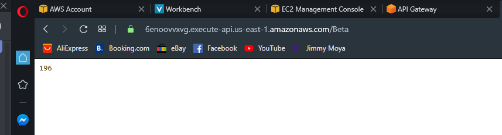
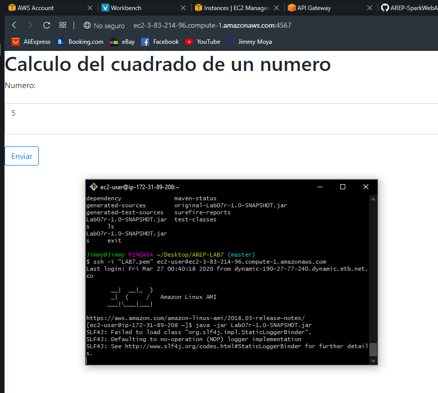
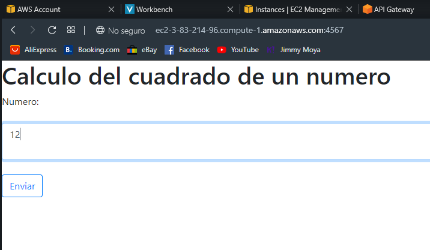
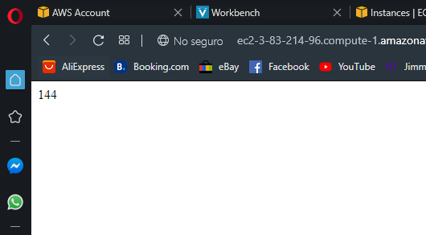

# AREP-LAB7

# - Requisitos
  Para poder realizar la implementación del ejercicio es necesario instalar:
 * [maven]

 * [java]
 
# - Ejecución
  - mvn package
  - java -jar "jarFile"
  
# - Capturas

# - Test

  - Con valor 12

  

[maven]: <https://maven.apache.org/>
[java]: <https://www.java.com/es/download/>
